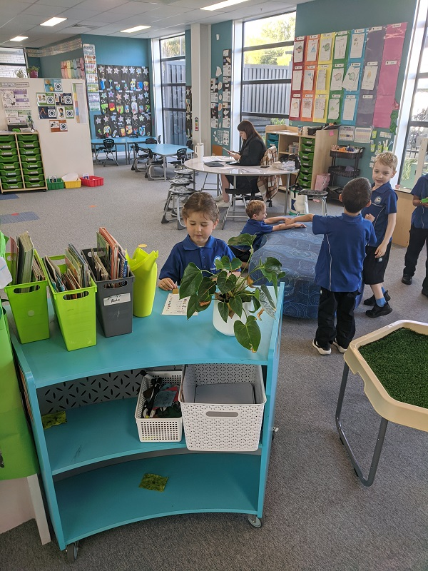
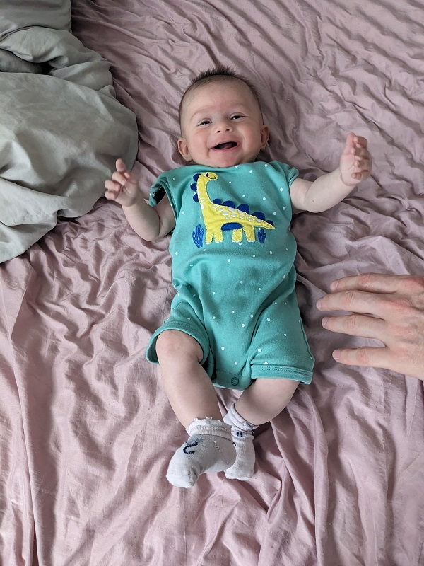
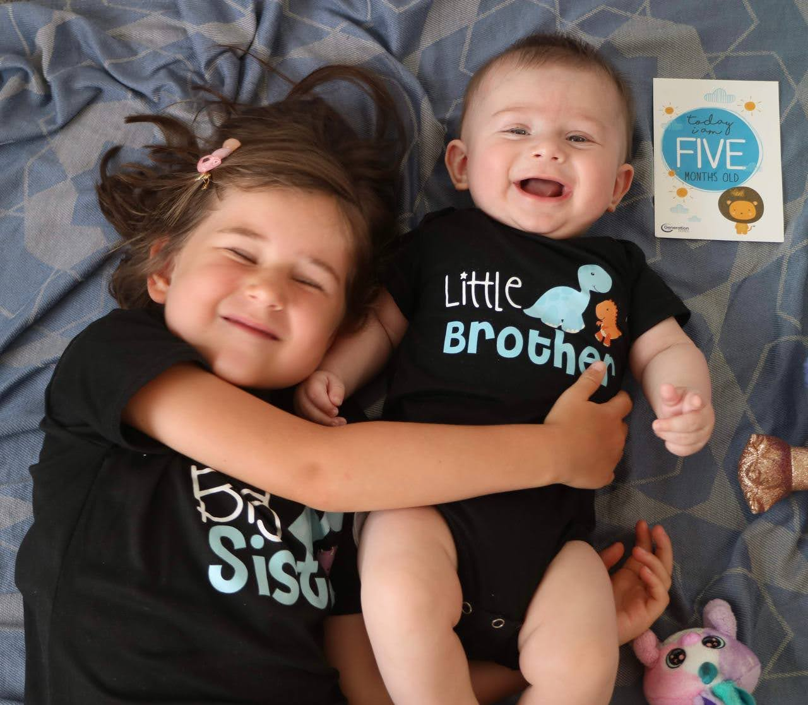

# Страничка про Соломийку!

 
 
## Словарь маленької Соломії
щус, нинишки, дапапай, машима, тапки,
 ноу, пасиба, баваська, гаяча, киска-мама,  
сядь,  дидууусь, тато на бапоти, туда, сыми, 
сыми моки, бабуся, зако, медыки, 
пити - пити- спати, стау, муун, живапа, 
виго виго ли та та, мияу-мияу, каляска, ш(ф)ишка,
 ици бици пайду, мыша, пепа, беби-шак, пташка,
 литачок, мутик, уди пака - пака, кавова - муу, 
ващёска, ням ням кусенько, абака - ваф ваф,
 ай-ски нада нада, муха - жу-жу, зук, кодил, 
паха, папужка, па попе, цуй, суй, пупус, укой
 ,тамамон, тильмин, супельмен, папа босдей ти ю,
 пистилин, пуничка, дяпую - баваська.   
 
 ## Соломійкіна історія  
 
Почала ходити в 1 рік і 1 місяць Почала танцювати в 1 рік спочатку на животі, а потім сидячі.  
 Тапки мамине і татові приміряв 1 рік і 7 місяців  
їжачка навчилися  робити до року в 11 місяців  
мяу навчилась казати в 7 місяців (бабуся навчила).   
Любила кататися по підлозі ковбаскою. Бабуся Надя научила робити "тринди бринди".  
Хро-хро - порося в 1 рік і 7 місяців бачить порося в книжках і хрюкає.  
Любить гортати книжки. В книжках познає звірів і показуює як вони розмовляють.  
На себе каже 'мяу'. Як звати дівчинку - каже 'мяу'.  
Манеж чорна діра - все в манеж. Весь посуд, іграшки і одяг.  
1 рік і 8 місяців принесли коробку від їжі Hello Fresh. Тато зробив хатинку - вирізав вікна. З'явилася нова чорна діра - все в хатинку. Не в манеж тільки зебра - піаніно, паротяг і кубик з іграми.  
Сама обирає собі одяг і взуття, потім приносить мамі щоб одягала.   
Собачка каже "гм-гм" не відкриваючи рота.  Любить бігати по калюжах.  
1 рік 8 місяців зламала ліжко, ногою видавила прутика.  
Улюблені мультики до року роніка, олівці-малівці і киця кицюня.  
1 рік 7 місяців - "Мака-Пака", "Мімімішечки", "Маленький великий пес", "Дівчинка і зайці". Впізнає тварин в "Як говорять тварини"  і каже раніше ніж в телевізорі.  
Кусає маму, тато, дідуся коли щось не подобається.  
Слоник каже - "ту-ту", муха і бджола - "жу-жу".  
Дзвонить бабусі - прикладає руку к вуху і каже - "ау". Якщо сказати "Алло" прикладає руку до вуха і  дзвонить бабусі.  
Використовує скло від плити як дзеркало, полюбляє крутитися коли щось примірює.  
 1 рік 8 місяців - улюблена іграшка кицька, любить з нею гратися і спати.  
1 рік 9 місяців полюбляю чистити зубки щіткою, може  чистити півгодини.  
Рахує один, два, тіі, ціціє,  "set on the floor"  сідає на попу (як в мультику Мака-Пака).  Каже "а-а" і в памперс.  Коли відкривають холодильник вмикає і вимикає світло кнопкою.  Рахує пташок в Мака-Пака. Коли прокидається - рахує єдинорожків,  цілує і робить "пі-пі". 
"Пі-пі" торкає носа і каже пі-пі. Годинник - "тік-так".  
5.06 виделкою їла. Наколює рукою їжу рибу і кумару на виделку і до рота.  
1 рік 10 місяців колобок - "бобок". "Пака-пака" якщо хтось уходить і ручкою махає.  
2 роки каже "пасибо", "Дяпую",      "бабуся",  "все", " пока-пока", "бай-бай".  На день народження купили замок - дуже раділа. Закидала кульками а потім викидала. Вміє залазити на горку. Трошки вміє їсти виделкою наколює картоплю, або рукою на виделку, а потім виделку до рота.  
"Подйом", "куті"- (крути скакалку)," "бабую" - часто повторює, не знаю що це." Ух ти", " Вот ето да", " пасибо", "баваська" (будь ласка).  
Сідає на дорослу гойдалку катається.  
2 роки 4 місяці говорить Мія І на себе пальчиком показує.  Бабуся, песик книжка з песиком,  Іде спати бере кита-подушку,  зайку, кицьку - набор щоб заснути. А песик каже гав! Сама каже  "гав". "Абака" - собака, "бока бока" - Колобок. Навчилися пригати на двох ногах на дивані, на батуті, на надувной горке.  
Не хотіла одягати нові босоніжки полюбляє "ласти" - такі носочко - тапочки,  
19.01.2021 - на горщик зробила пісь пісь перший раз.  
Татусь - *о-ту-ру-ту*  
почала до садика ходити. Одягла на ручки сині рукавички і попу собі підтирає,  як у садочку роблять. Як попісяє - показує ведмедику, жирафі щоб похвалили. Ведмедик - "медики", жирафа - "живапа". Полюбляє коли хвалять.  
Пісеньки "a b c d e", baby shark, mittens.  
Три роки - подарували Baby Shark, Octopus і багато кульок. Бебішарка прокусила.  
Трошки вміє рахувати. Полюбляє бігати каже "дідусь  біста" і біжить. Букає. Інколи каже "монин"," бабл" , " айски' - англичанка!

 ## Соломійкіни фразочки
паламала тамамон по попе по попе  
Это такой большой планшет.(Большой рекламный
 телевизор на пристани)   
Дидусь ручки замотай.(Сложи ручки, чтобы было теплей)   
Это как шоколадка только обнимашка.   
Надеть костюн. (Играет в железного человека)  
Шапку домой шапку домой. (Песенка "шапку долой из мультика про царевну")   
Дидусь - Лунный дидусь, а Мия - Аллет  
Суперскорость. ("Герои в масках" - мультик, Аллет, 
Лунная Девочка, Гекко, Кетбой - герои)   
Что уже полдесятого покажи! (говорит утром, когда
 просыпается и садик опаздывает)   
Это такая русалочка (ножки в одну дырку от трусов)  
Ого себе (ничего себе),  больше хватит (больше не надо) -
Миины выражения сама придумала
## Міічці вже 4 роки! 
Дідусь, ти не очки надел?  
Дідусь ти самий такой в міре дідусь, тебе надо подаруночек    
Не люблю соломенный бычок он противный липкий,   
Трусы это маска для попы,  
Мия - смотри лошадка,   " -я думаю это корова"

 это собака маленький милый, а этот собака большой злой его надо в тюрьму

мама можно шоколадку - "нет"  
&emsp;-тогда я тебе сотру помаду и ты будешь некрасивая.

мама хочу цукерку не шоколадку а на палочке лисенькую.

Мия, почему у тебя сова вся черная?  
&emsp; - она кремом не намазалась и на солнце обгорела.

Мія, кушай кашу  
&emsp;-хорошо,  а потом конфетку  
потом суп с котом  
&emsp;-хорошо, только сладенький.  

Мія, зробимо курочку з ананасами    
&emsp;-ура, тільки мені без курочки!  

-У нас у садочку сьогодні було дві нових виховательки і з ними розмовляла англійською!  
-і що ти казала?  
-е-е-е-е.  

Мія пішли спати - ще 5 хвилин і все  
&emsp;	- добре 5 хвилин, тільки довгих

Мія лежить і бабусю ножками буцає  
&emsp;-дідусь скажи -'Мія не бий бабусю 
&emsp;-бабуся скажи -'А мені подобається'  

Мія дивиться на стареньку пару(йдуть з паличками) і каже     &emsp;  -а в мене бабуся молода, в неї тільки сісікі великі

## Міїчці 5 років, вона пішла до школи 

## У Мії з'явився братик Омельчик

-Хочу знову бути малючком - лежишь ореш і всі тебе обожнюють!

Мія, про що фільм "Гарі Потер"?    &emsp; - там був такий великий червяк, Гарі Потер уколов його мечом і він помер!

Дідусь, візьми краба, не бійся він мертвий, це нормально - всі помирають   

### Омельчику 5 місяців

 

